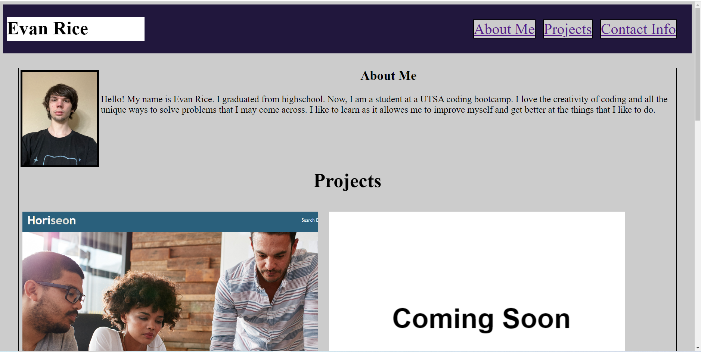
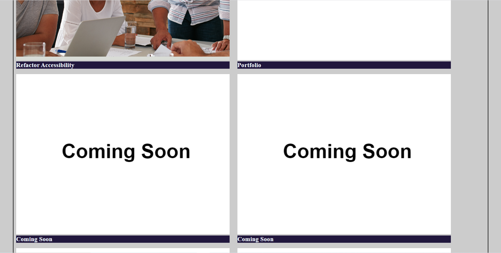
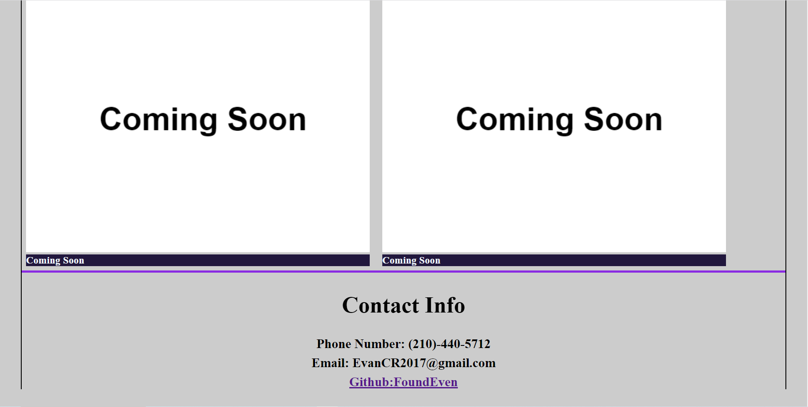

# WeekTwoChallenge_Portfolio

## Description

My motivation for creating a online portfolio is to show of my work to others and employers. I built this project to understand how to style a website and show of some of the skills that I have learned in CSS. The building of this website solves the problem of employers not being able to find my work, contact info, or my gitlab easily. I learned how much CSS can influence a websites looks to make it more appealing.

## Usage

- You can use the navagation bar at the top right of the page to go to the section that you wish to look at.
- You can click on the pictures of the deployed websites to head straight to the website that you clicked on.

## Website

## Link
This is a link to the webpage:
